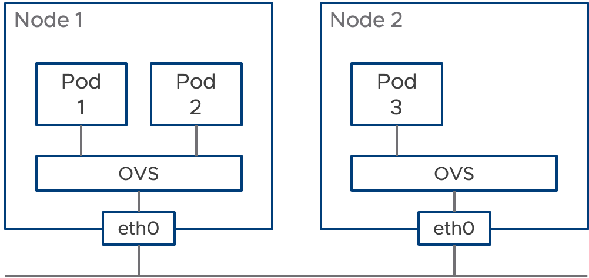

# Traceflow

## Traceflow basic information

[https://github.com/vmware-tanzu/antrea/blob/main/docs/traceflow-guide.md]

## Setup

This demo scenario assumes the following conditions are met.

- Traceflow is enabeld
- 2 worker nodes or more in a cluster
- Demo use default namespace

Please apply the manifests under `manifests` directory to go through this demo.

```shell
kubectl apply -f manifests/
```

Once they are applied, 3 nginx pods and 2 networkpolicies are deployed like the below diagram.



The networkpolicies are configured only allow HTTP connection from pod1 to pod2 and pod3.

Please confirm that pod1 and pod2 are running on the same node and pod3 is on a different node.

```text
# kubectl get pod -o wide
NAME   READY   STATUS    RESTARTS   AGE   IP            NODE                         NOMINATED NODE   READINESS GATES
pod1   1/1     Running   0          59m   172.16.5.11   k8s2-md-0-647454fc57-9sf7n   <none>           <none>
pod2   1/1     Running   0          59m   172.16.5.12   k8s2-md-0-647454fc57-9sf7n   <none>           <none>
pod3   1/1     Running   0          59m   172.16.3.8    k8s2-md-0-647454fc57-qpqbg   <none>           <none>
```

## Scenarios

### Traceflow between pods in the same node

Let's create a traceflow manifest and see a result from pod1 to pod2.

```yaml
apiVersion: ops.antrea.tanzu.vmware.com/v1alpha1
kind: Traceflow
metadata:
  name: tf-pod1-to-pod2
spec:
  source:    
    pod: pod1
    namespace: default    
  destination:
    pod: pod2
    namespace: default
  packet:
    ipHeader:
      protocol: 6
    transportHeader:
      tcp:
        srcPort: 10002
        dstPort: 80
```

Since only HTTP packet is allowed, TCP with destination port 80 is specified in the traceflow.
Now apply the manifest.

```text
kubectl apply -f ./tf-pod1-to-pod2.yml
```

Once it's done, the result will be like this.

```yaml
# kubectl get tf tf-pod1-to-pod2 -o yaml
apiVersion: ops.antrea.tanzu.vmware.com/v1alpha1
kind: Traceflow
metadata:
  annotations:
    kubectl.kubernetes.io/last-applied-configuration: |
      {"apiVersion":"ops.antrea.tanzu.vmware.com/v1alpha1","kind":"Traceflow","metadata":{"annotations":{},"name":"tf-pod1-to-pod2"},"spec":{"destination":{"namespace":"default","pod":"pod2"},"packet":{"ipHeader":{"protocol":6},"transportHeader":{"tcp":{"dstPort":80,"srcPort":10002}}},"source":{"namespace":"default","pod":"pod1"}}}
  creationTimestamp: "2021-04-09T15:02:05Z"
  generation: 1
  name: tf-pod1-to-pod2
  resourceVersion: "165167"
  uid: 776a4488-dbf1-4cbe-b048-9f6cafe2c26b
spec:
  destination:
    namespace: default
    pod: pod2
  packet:
    ipHeader:
      protocol: 6
    transportHeader:
      tcp:
        dstPort: 80
        srcPort: 10002
  source:
    namespace: default
    pod: pod1
status:
  phase: Succeeded
  results:
  - node: k8s2-md-0-647454fc57-9sf7n
    observations:
    - action: Forwarded
      component: SpoofGuard
    - action: Forwarded
      component: NetworkPolicy
      componentInfo: EgressRule
      networkPolicy: K8sNetworkPolicy:default/allow-egress-to-pod2
    - action: Forwarded
      component: NetworkPolicy
      componentInfo: IngressRule
      networkPolicy: K8sNetworkPolicy:default/allow-ingress-from-pod1
    - action: Delivered
      component: Forwarding
      componentInfo: Output
    timestamp: 1617980525
```

The generated packet went through several components.

1. SpoofGuard
2. NetworkPolicy for Egress
3. NetworkPolicy for Ingress
4. Forwarding

The last action, Delivered, means that generated packet successfully reached out to the destination.

If ICMP which is not allowed is specified in traceflow, the ICMP packet is dropped in NetworkPolicy for Ingress and traceflow shows the reason.

```text
# kubectl get tf tf-pod1-to-pod2-icmp -o yaml
apiVersion: ops.antrea.tanzu.vmware.com/v1alpha1
kind: Traceflow
metadata:
  annotations:
    kubectl.kubernetes.io/last-applied-configuration: |
      {"apiVersion":"ops.antrea.tanzu.vmware.com/v1alpha1","kind":"Traceflow","metadata":{"annotations":{},"name":"tf-pod1-to-pod2-icmp"},"spec":{"destination":{"namespace":"default","pod":"pod2"},"packet":{"ipHeader":{"protocol":1}},"source":{"namespace":"default","pod":"pod1"}}}
  creationTimestamp: "2021-04-09T15:08:46Z"
  generation: 1
  name: tf-pod1-to-pod2-icmp
  resourceVersion: "166700"
  uid: e41a290b-c024-4c5a-b8ae-494b461f2bba
spec:
  destination:
    namespace: default
    pod: pod2
  packet:
    ipHeader:
      protocol: 1
  source:
    namespace: default
    pod: pod1
status:
  phase: Succeeded
  results:
  - node: k8s2-md-0-647454fc57-9sf7n
    observations:
    - action: Forwarded
      component: SpoofGuard
    - action: Forwarded
      component: NetworkPolicy
      componentInfo: EgressRule
      networkPolicy: K8sNetworkPolicy:default/allow-egress-to-pod2
    - action: Dropped
      component: NetworkPolicy
      componentInfo: IngressDefaultRule
    timestamp: 1617980926
```
