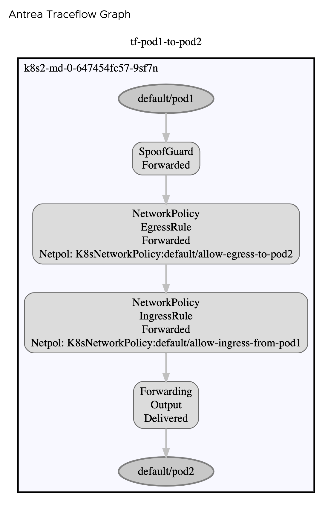
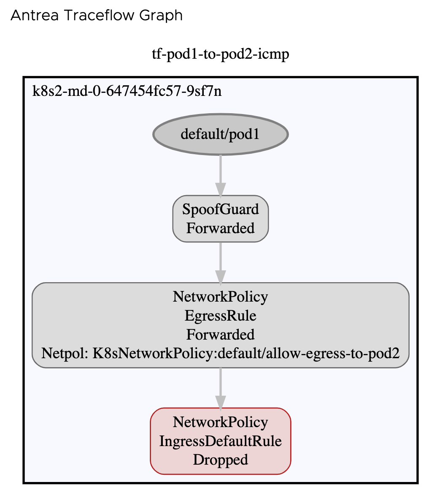
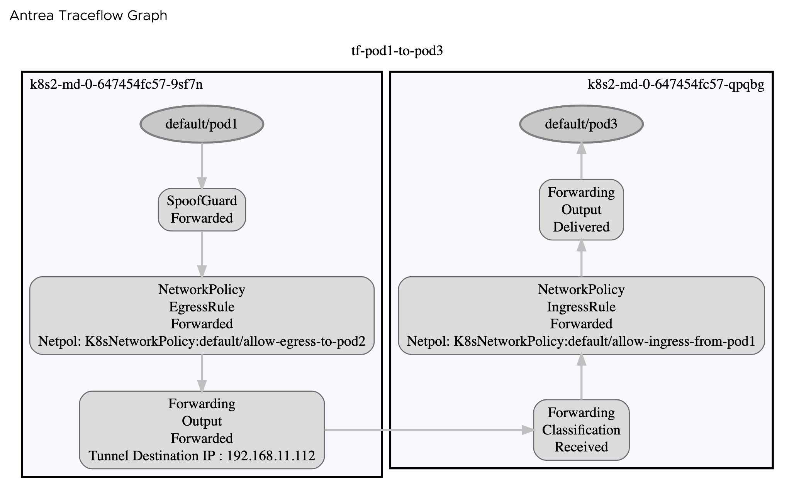
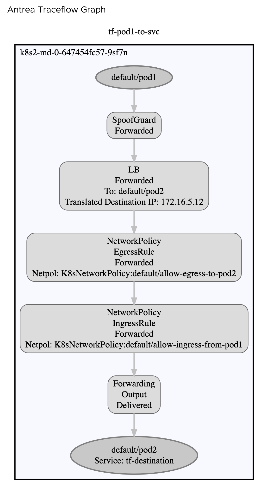
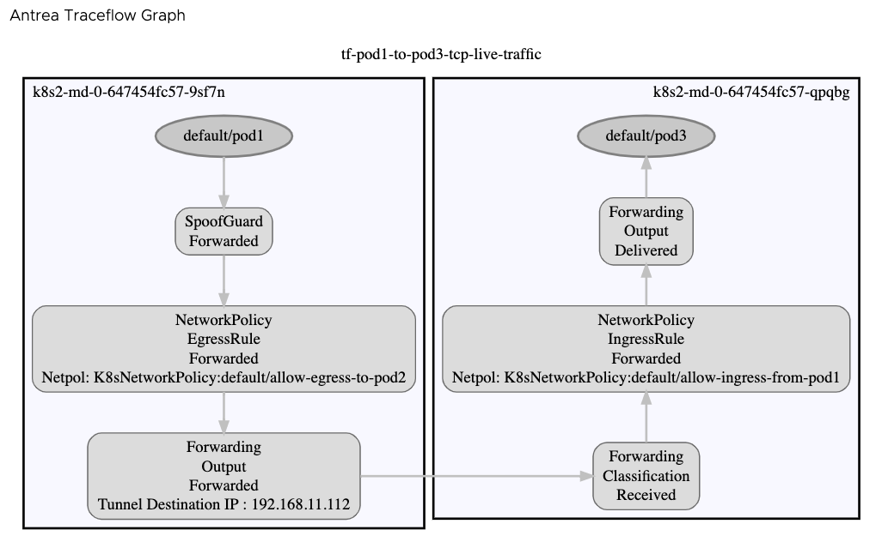

# Traceflow

## Traceflow basic information

[https://github.com/vmware-tanzu/antrea/blob/main/docs/traceflow-guide.md]

## Setup

This demo scenario assumes the following conditions are met.

- Traceflow is enabeld
- 2 worker nodes or more in a cluster
- Demo use default namespace

Please apply the manifests under `manifests` directory to go through this demo.

```shell
kubectl apply -f manifests/
```

Once they are applied, 3 nginx pods and 2 networkpolicies are deployed like the below diagram.


The networkpolicies are configured only allow HTTP connection from pod1 to pod2 and pod3.

Please confirm that pod1 and pod2 are running on the same node and pod3 is on a different node.

```text
# kubectl get pod -o wide
NAME   READY   STATUS    RESTARTS   AGE   IP            NODE                         NOMINATED NODE   READINESS GATES
pod1   1/1     Running   0          59m   172.16.5.11   k8s2-md-0-647454fc57-9sf7n   <none>           <none>
pod2   1/1     Running   0          59m   172.16.5.12   k8s2-md-0-647454fc57-9sf7n   <none>           <none>
pod3   1/1     Running   0          59m   172.16.3.8    k8s2-md-0-647454fc57-qpqbg   <none>           <none>
```

## Scenarios

### Traceflow between pods in the same node

Let's create a traceflow manifest and see a result from pod1 to pod2.

```yaml
apiVersion: crd.antrea.io/v1alpha1
kind: Traceflow
metadata:
  name: tf-pod1-to-pod2
spec:
  source:
    pod: pod1
    namespace: default
  destination:
    pod: pod2
    namespace: default
  packet:
    ipHeader:
      protocol: 6
    transportHeader:
      tcp:
        srcPort: 10002
        dstPort: 80
```

Since only HTTP packet is allowed, TCP with destination port 80 is specified in the traceflow.
Now apply the manifest.

```text
kubectl apply -f ./tf-pod1-to-pod2.yml
```

Once it's done, the result will be like this.

```yaml
# kubectl get tf tf-pod1-to-pod2 -o yaml
apiVersion: crd.antrea.io/v1alpha1
kind: Traceflow
metadata:
  annotations:
    kubectl.kubernetes.io/last-applied-configuration: |
      {"apiVersion":"crd.antrea.io/v1alpha1","kind":"Traceflow","metadata":{"annotations":{},"name":"tf-pod1-to-pod2"},"spec":{"destination":{"namespace":"default","pod":"pod2"},"packet":{"ipHeader":{"protocol":6},"transportHeader":{"tcp":{"dstPort":80,"srcPort":10002}}},"source":{"namespace":"default","pod":"pod1"}}}
  creationTimestamp: "2021-04-13T05:44:41Z"
  generation: 1
  name: tf-pod1-to-pod2
  resourceVersion: "1359705"
  uid: 3dd0fd11-3194-481a-8b25-0798c94c1a1c
spec:
  destination:
    namespace: default
    pod: pod2
  packet:
    ipHeader:
      protocol: 6
    transportHeader:
      tcp:
        dstPort: 80
        srcPort: 10002
  source:
    namespace: default
    pod: pod1
status:
  phase: Succeeded
  results:
  - node: k8s2-md-0-647454fc57-9sf7n
    observations:
    - action: Forwarded
      component: SpoofGuard
    - action: Forwarded
      component: NetworkPolicy
      componentInfo: EgressRule
      networkPolicy: K8sNetworkPolicy:default/allow-egress-to-pod2
    - action: Forwarded
      component: NetworkPolicy
      componentInfo: IngressRule
      networkPolicy: K8sNetworkPolicy:default/allow-ingress-from-pod1
    - action: Delivered
      component: Forwarding
      componentInfo: Output
    timestamp: 1618292681
```




The generated packet went through several components.

1. SpoofGuard
2. NetworkPolicy for Egress
3. NetworkPolicy for Ingress
4. Forwarding

The last action, Delivered, means that generated packet successfully reached out to the destination.

If ICMP which is not allowed is specified in traceflow, the ICMP packet is dropped in NetworkPolicy for Ingress and traceflow shows the reason.

```text
# kubectl get tf tf-pod1-to-pod2-icmp -o yaml
apiVersion: crd.antrea.io/v1alpha1
kind: Traceflow
metadata:
  annotations:
    kubectl.kubernetes.io/last-applied-configuration: |
      {"apiVersion":"crd.antrea.io/v1alpha1","kind":"Traceflow","metadata":{"annotations":{},"name":"tf-pod1-to-pod2-icmp"},"spec":{"destination":{"namespace":"default","pod":"pod2"},"packet":{"ipHeader":{"protocol":1}},"source":{"namespace":"default","pod":"pod1"}}}
  creationTimestamp: "2021-04-13T05:44:41Z"
  generation: 1
  name: tf-pod1-to-pod2-icmp
  resourceVersion: "1359703"
  uid: b258de67-ea95-4710-b1a0-587404acc193
spec:
  destination:
    namespace: default
    pod: pod2
  packet:
    ipHeader:
      protocol: 1
  source:
    namespace: default
    pod: pod1
status:
  phase: Succeeded
  results:
  - node: k8s2-md-0-647454fc57-9sf7n
    observations:
    - action: Forwarded
      component: SpoofGuard
    - action: Forwarded
      component: NetworkPolicy
      componentInfo: EgressRule
      networkPolicy: K8sNetworkPolicy:default/allow-egress-to-pod2
    - action: Dropped
      component: NetworkPolicy
      componentInfo: IngressDefaultRule
    timestamp: 1618292681
```




### Traceflow between pods across nodes

Let's create the same traceflow but for pod1 and pod3. 

```yaml
apiVersion: crd.antrea.io/v1alpha1
kind: Traceflow
metadata:
  name: tf-pod1-to-pod3
spec:
  source:    
    pod: pod1
    namespace: default    
  destination:
    pod: pod3
    namespace: default
  packet:
    ipHeader:
      protocol: 6
    transportHeader:
      tcp:
        srcPort: 10002
        dstPort: 80
```

Since only HTTP packet is allowed, TCP with destination port 80 is specified in the traceflow.
Now apply the manifest.

```text
kubectl apply -f ./tf-pod1-to-pod3.yml
```

Once it's done, the result will be like this.

```yaml
# kubectl get tf tf-pod1-to-pod3 -o yaml
apiVersion: crd.antrea.io/v1alpha1
kind: Traceflow
metadata:
  annotations:
    kubectl.kubernetes.io/last-applied-configuration: |
      {"apiVersion":"crd.antrea.io/v1alpha1","kind":"Traceflow","metadata":{"annotations":{},"name":"tf-pod1-to-pod3"},"spec":{"destination":{"namespace":"default","pod":"pod3"},"packet":{"ipHeader":{"protocol":6},"transportHeader":{"tcp":{"dstPort":80,"srcPort":10002}}},"source":{"namespace":"default","pod":"pod1"}}}
  creationTimestamp: "2021-04-13T05:39:57Z"
  generation: 1
  name: tf-pod1-to-pod3
  resourceVersion: "1358218"
  uid: 87cfca80-a371-4370-9c0e-ae8aaae53435
spec:
  destination:
    namespace: default
    pod: pod3
  packet:
    ipHeader:
      protocol: 6
    transportHeader:
      tcp:
        dstPort: 80
        srcPort: 10002
  source:
    namespace: default
    pod: pod1
status:
  phase: Succeeded
  results:
  - node: k8s2-md-0-647454fc57-9sf7n
    observations:
    - action: Forwarded
      component: SpoofGuard
    - action: Forwarded
      component: NetworkPolicy
      componentInfo: EgressRule
      networkPolicy: K8sNetworkPolicy:default/allow-egress-to-pod2
    - action: Forwarded
      component: Forwarding
      componentInfo: Output
      tunnelDstIP: 192.168.11.112
    timestamp: 1618292402
  - node: k8s2-md-0-647454fc57-qpqbg
    observations:
    - action: Received
      component: Forwarding
      componentInfo: Classification
    - action: Forwarded
      component: NetworkPolicy
      componentInfo: IngressRule
      networkPolicy: K8sNetworkPolicy:default/allow-ingress-from-pod1
    - action: Delivered
      component: Forwarding
      componentInfo: Output
    timestamp: 1618292402
```

Now the generated packet actually traverse from the source node to the destination node.

On the souce node, it went through:

1. SpoofGuard
2. NetworkPolicy for Egress
3. Forwarding(Geneve Tunnel)

On the destination node, it went through:

4. Forwarding(Geneve Tunnel)
5. NetworkPolicy for Ingress
6. Forwarding

Likewise, the last action is `Delivered`. The generated pacekt successfully reached out to the destination.



### Traceflow to service

Let's try another usecase of traceflow to Service. By doing this, you can make sure that there is connectivity from one pod to a service.

We have a service called `tf-destination`.

```text
# kubectl get svc
NAME             TYPE        CLUSTER-IP       EXTERNAL-IP   PORT(S)   AGE
kubernetes       ClusterIP   172.30.0.1       <none>        443/TCP   4d4h
tf-destination   ClusterIP   172.30.191.124   <none>        80/TCP    3d17h
```

This service has pod2 and pod3 as backend. If packets are sent to service `tf-destination`, they will go to either of pod2 or pod3.

```text
# kubectl describe svc tf-destination
Name:              tf-destination
Namespace:         default
Labels:            <none>
Annotations:       <none>
Selector:          role=destination
Type:              ClusterIP
IP Families:       <none>
IP:                172.30.191.124
IPs:               172.30.191.124
Port:              http  80/TCP
TargetPort:        80/TCP
Endpoints:         172.16.3.8:80,172.16.5.12:80
Session Affinity:  None
Events:            <none>
```

The Traceflow manifest is like below. You just have to have a service instead of pod.

```yaml
apiVersion: crd.antrea.io/v1alpha1
kind: Traceflow
metadata:
  name: tf-pod1-to-svc
spec:
  source:
    pod: pod1
    namespace: default
  destination:
    service: tf-destination
    namespace: default
  packet:
    ipHeader:
      protocol: 6
    transportHeader:
      tcp:
        dstPort: 80
```

Once the Traceflow is done, you can check the status.

```text
# kubectl get tf tf-pod1-to-svc -o yaml
apiVersion: crd.antrea.io/v1alpha1
kind: Traceflow
metadata:
  annotations:
    kubectl.kubernetes.io/last-applied-configuration: |
      {"apiVersion":"crd.antrea.io/v1alpha1","kind":"Traceflow","metadata":{"annotations":{},"name":"tf-pod1-to-svc"},"spec":{"destination":{"namespace":"default","service":"tf-destination"},"packet":{"ipHeader":{"protocol":6},"transportHeader":{"tcp":{"dstPort":80}}},"source":{"namespace":"default","pod":"pod1"}}}
  creationTimestamp: "2021-04-13T06:52:25Z"
  generation: 1
  name: tf-pod1-to-svc
  resourceVersion: "1381462"
  uid: 464e1365-3a4c-40ad-9e53-a89bf623858c
spec:
  destination:
    namespace: default
    service: tf-destination
  packet:
    ipHeader:
      protocol: 6
    transportHeader:
      tcp:
        dstPort: 80
  source:
    namespace: default
    pod: pod1
status:
  phase: Succeeded
  results:
  - node: k8s2-md-0-647454fc57-9sf7n
    observations:
    - action: Forwarded
      component: SpoofGuard
    - action: Forwarded
      component: LB
      pod: default/pod2
      translatedDstIP: 172.16.5.12
    - action: Forwarded
      component: NetworkPolicy
      componentInfo: EgressRule
      networkPolicy: K8sNetworkPolicy:default/allow-egress-to-pod2
    - action: Forwarded
      component: NetworkPolicy
      componentInfo: IngressRule
      networkPolicy: K8sNetworkPolicy:default/allow-ingress-from-pod1
    - action: Delivered
      component: Forwarding
      componentInfo: Output
    timestamp: 1618296750
```

You can see the same result as the one to a pod. But a new component, LB, is seen after SpoofGuard. Traceflow reports not only packet path for Service but also which pod is used. pod2 was used in this example.



### Traceflow to capture live-traffic

Since Antrea v1.0.0, Traceflow supports capturing a live-traffic packet.
This tells us the reason that the actual traffic gets dropped. In order to support this, 2 options are added in v1.0.0.

- `liveTraffic`
- `droppedOnly`

#### Capture traffic match source, destination and protocol

```yaml
apiVersion: crd.antrea.io/v1alpha1
kind: Traceflow
metadata:
  name: tf-pod1-to-pod3-tcp-live-traffic
spec:
  liveTraffic: true
  source:    
    pod: pod1
    namespace: default    
  destination:
    pod: pod3
    namespace: default
  packet:
    ipHeader:
      protocol: 6
    transportHeader:
      tcp:
        dstPort: 80
```

After you configure traceflow, please do `curl` or `wget` on pod1 to pod3.
Once it's done, the traceflow phase will be `Succeeded` and you get the information of the captured packet.

```text
# kubectl get tf tf-pod1-to-pod3-tcp-live-traffic -o wide
NAME                               PHASE       SOURCE-POD   DESTINATION-POD   DESTINATION-IP   LIVE-TRAFFIC   DROPPED-ONLY   TIMEOUT   AGE
tf-pod1-to-pod3-tcp-live-traffic   Succeeded   pod1         pod3                               true                                    2m46s
```

```text
# kubectl get tf tf-pod1-to-pod3-tcp-live-traffic -o yaml
apiVersion: crd.antrea.io/v1alpha1
kind: Traceflow
metadata:
  annotations:
    kubectl.kubernetes.io/last-applied-configuration: |
      {"apiVersion":"crd.antrea.io/v1alpha1","kind":"Traceflow","metadata":{"annotations":{},"name":"tf-pod1-to-pod3-tcp-live-traffic"},"spec":{"destination":{"namespace":"default","pod":"pod3"},"liveTraffic":true,"packet":{"ipHeader":{"protocol":6},"transportHeader":{"tcp":{"dstPort":80}}},"source":{"namespace":"default","pod":"pod1"}}}
  creationTimestamp: "2021-04-16T06:03:03Z"
  generation: 1
  name: tf-pod1-to-pod3-tcp-live-traffic
  resourceVersion: "2743207"
  uid: 8d4af20a-ef10-4903-bed2-51c917df3416
spec:
  destination:
    namespace: default
    pod: pod3
  liveTraffic: true
  packet:
    ipHeader:
      protocol: 6
    transportHeader:
      tcp:
        dstPort: 80
  source:
    namespace: default
    pod: pod1
status:
  capturedPacket:
    dstIP: 172.16.3.8
    ipHeader:
      flags: 2
      protocol: 6
      ttl: 63
    length: 60
    srcIP: 172.16.5.11
    transportHeader:
      tcp:
        dstPort: 80
        flags: 2
        srcPort: 56350
  phase: Succeeded
  results:
  - node: k8s2-md-0-647454fc57-9sf7n
    observations:
    - action: Forwarded
      component: SpoofGuard
    - action: Forwarded
      component: NetworkPolicy
      componentInfo: EgressRule
      networkPolicy: K8sNetworkPolicy:default/allow-egress-to-pod2
    - action: Forwarded
      component: Forwarding
      componentInfo: Output
      tunnelDstIP: 192.168.11.112
    timestamp: 1618552987
  - node: k8s2-md-0-647454fc57-qpqbg
    observations:
    - action: Received
      component: Forwarding
      componentInfo: Classification
    - action: Forwarded
      component: NetworkPolicy
      componentInfo: IngressRule
      networkPolicy: K8sNetworkPolicy:default/allow-ingress-from-pod1
    - action: Delivered
      component: Forwarding
      componentInfo: Output
    timestamp: 1618552987
```

You can also get the same graph in Octant like below.



#### Capture droped packet

Let's use `dropppedOnly` flag this time. If this flag is enabled, only dropped packet will be captured.
The Traceflow manifest for this time is like below:

```yaml
apiVersion: crd.antrea.io/v1alpha1
kind: Traceflow
metadata:
  name: tf-pod1-to-pod3-icmp-live-traffic
spec:
  liveTraffic: true
  droppedOnly: true
  source:    
    pod: pod1
    namespace: default    
  destination:
    pod: pod3
    namespace: default
  packet:
    ipHeader:
      protocol: 1
```

```yaml
# kubectl get tf tf-pod1-to-pod3-icmp-live-traffic -o wide
NAME                                PHASE       SOURCE-POD   DESTINATION-POD   DESTINATION-IP   LIVE-TRAFFIC   DROPPED-ONLY   TIMEOUT   AGE
tf-pod1-to-pod3-icmp-live-traffic   Succeeded   pod1         pod3                               true           true                     9s
```

```yaml
# kubectl get tf tf-pod1-to-pod3-icmp-live-traffic -o yaml
apiVersion: crd.antrea.io/v1alpha1
kind: Traceflow
metadata:
  annotations:
    kubectl.kubernetes.io/last-applied-configuration: |
      {"apiVersion":"crd.antrea.io/v1alpha1","kind":"Traceflow","metadata":{"annotations":{},"name":"tf-pod1-to-pod3-icmp-live-traffic"},"spec":{"destination":{"namespace":"default","pod":"pod3"},"droppedOnly":true,"liveTraffic":true,"packet":{"ipHeader":{"protocol":1}},"source":{"namespace":"default","pod":"pod1"}}}
  creationTimestamp: "2021-04-16T06:31:12Z"
  generation: 1
  name: tf-pod1-to-pod3-icmp-live-traffic
  resourceVersion: "2752207"
  uid: c7b2c3c8-edaa-4aac-a61b-fbeaf54aac7e
spec:
  destination:
    namespace: default
    pod: pod3
  droppedOnly: true
  liveTraffic: true
  packet:
    ipHeader:
      protocol: 1
  source:
    namespace: default
    pod: pod1
status:
  capturedPacket:
    dstIP: 172.16.3.8
    ipHeader:
      flags: 2
      protocol: 1
      ttl: 62
    length: 84
    srcIP: 172.16.5.11
    transportHeader: {}
  phase: Succeeded
  results:
  - node: k8s2-md-0-647454fc57-qpqbg
    observations:
    - action: Received
      component: Forwarding
      componentInfo: Classification
    - action: Dropped
      component: NetworkPolicy
      componentInfo: IngressDefaultRule
    timestamp: 1618554680
```


